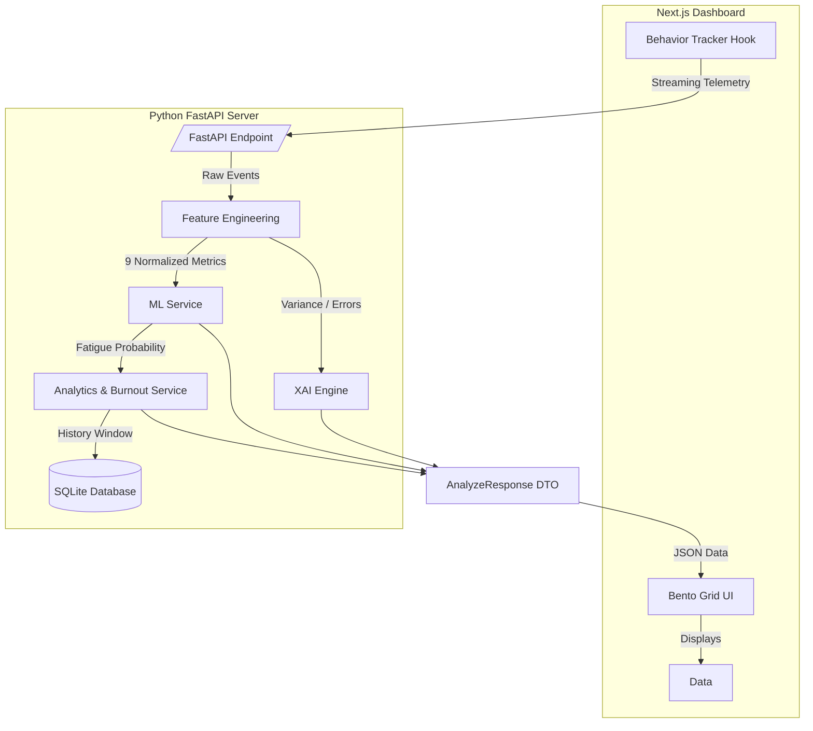

# NeuroTrack AI 🧠⚡️
**Real-Time Cognitive Fatigue Detection & Burnout Predictor**

NeuroTrack AI is a hackathon-winning, production-ready health-tech platform that continuously monitors user interaction patterns (typing speed, variance, mouse movements, and idle times) to calculate a real-time **NeuroScore** and proactively prevent digital burnout.

---

## 🚀 Problem Statement
The modern knowledge worker spends 8-10 hours a day interacting with digital interfaces. This prolonged exposure leads to **cognitive fatigue**, **diminished focus**, and **chronic burnout**. Current tools rely on subjective self-reporting (like surveys) or invasive hardware (like eye trackers) which disrupt workflow and privacy.

## 💡 The Solution
NeuroTrack AI acts as an **invisible, continuous cognitive monitor**. By analyzing the micro-behaviors of how a user interacts with their machine (typing cadence, error rates, micro-pauses), our AI model can detect fatigue *before* the user consciously feels it.

If sustained fatigue is detected, the system triggers a **Burnout Risk Alert** and provides a dynamic **AI Focus Report** with specific recovery recommendations. 

---

## ✨ Key Features
1. **The NeuroScore (0-100)**: A proprietary, normalized index of your current cognitive focus.
2. **Explainable AI (XAI)**: We don't just give you a score. Our "Focus Contributors" engine tells you exactly *why* your score changed (ex. "High Typing Variance detected").
3. **Burnout Prediction**: We analyze a rolling window of your behavioral history to catch sustained fatigue trends and trigger proactive alerts.
4. **World-Class Dashboard**: A stunning, ultra-responsive UI built with Next.js, Framer Motion, and Tailwind CSS.

---

## 🏗️ Technical Architecture
NeuroTrack AI is built on a clean, scalable, client-server architecture.



---

## 🧠 AI Model Explanation
Our system uses a Machine Learning model trained on simulated telemetry mimicking typing speeds, error rates, and interaction latency.
Instead of relying on a single data point, our **Feature Extraction Engine** calculates 9 advanced metrics over a sliding window:
*   `typing_speed`
*   `typing_variance`
*   `error_rate`
*   `idle_time`
*   `reaction_delay`
*   `speed_drop_rate`
*   `error_acceleration`
*   `idle_spike_score`
*   `focus_stability_index`

---

## 💻 Installation & Setup

### 1. Backend (FastAPI + Python)
```bash
cd backend
python -m venv venv
source venv/bin/activate
pip install -r requirements.txt
python -m uvicorn app.main:app --reload
```

### 2. Frontend (Next.js + React)
```bash
cd frontend
npm install
npm run dev
```

### 3. Usage
Navigate to `http://localhost:3000`. The system will automatically begin simulating/capturing telemetry, and the AI Focus Meter will calibrate in real-time!

---

## 🔮 Future Scope
*   **Webcam Integration**: Combining behavioral telemetry with computer vision for blink-rate analysis.
*   **IDE Extensions**: Bringing NeuroTrack directly into VSCode for developers.
*   **Enterprise Team Analytics**: Helping managers prevent team-wide burnout before a major product launch.
